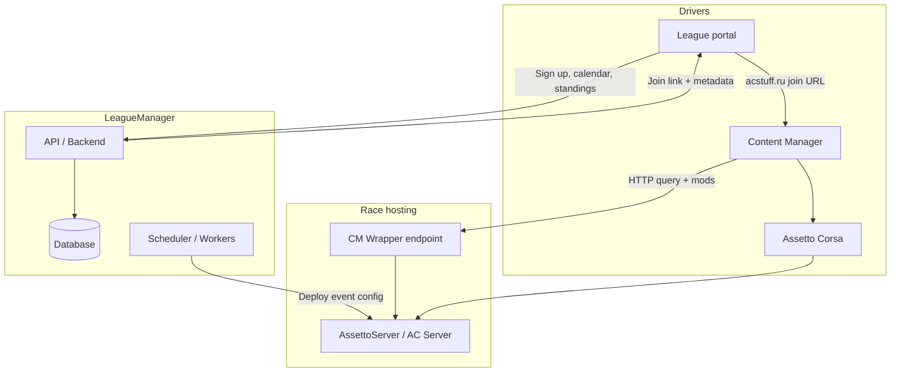

# Proposed Architecture

> **Note:** The project direction is now a **desktop app** (host + driver panels), not a web portal. See **[PLAN.md](PLAN.md)** for the current detailed plan. This document retains earlier web-oriented notes for reference.

Based on [RESEARCH.md](RESEARCH.md). This is a planning document, not implemented code.

## Design principles

1. **Web-first** — Admin and driver portals in the browser; CM handles the last mile to the sim.
2. **CM-native join path** — Every scheduled session exposes a join URL drivers already understand.
3. **Server-agnostic** — Support vanilla AC server, AssettoServer, and optionally Assetto Server Manager.
4. **Self-hostable** — Docker-compose friendly; no mandatory SaaS.
5. **Progressive enhancement** — Works with basic join links alone; CMW/server details add mod installs and rich descriptions.

---

## High-level diagram



---

## Core components

### 1. League API (backend)

**Responsibilities**

- Leagues, seasons, divisions, events (practice / quali / race)
- Driver accounts (Steam OpenID recommended — matches CM/Rorzone/ACSR patterns)
- Registration, waitlists, team entries
- Points engines (configurable schemas per championship)
- Notification hooks (Discord webhooks, email optional)

**Tech candidates**: Node (SvelteKit full-stack), Go (align with ACSM ecosystem), or .NET (align with AssettoServer).

### 2. Driver portal (frontend)

**Key screens**

- League home — next race countdown + **Join race** button (CM link)
- Season calendar with ICS export
- Standings / results
- My registrations
- Mod pack checklist with links (pre-race)

**Join button implementation**

```typescript
function buildCmJoinLink(event: RaceEvent): string {
  const url = new URL('https://acstuff.ru/s/q:race/online/join');
  url.searchParams.set('ip', event.serverPublicIp);
  url.searchParams.set('httpPort', String(event.serverHttpPort));
  if (event.password) url.searchParams.set('password', event.password);
  return url.toString();
}
```

### 3. CM integration layer

Three tiers (implement in order):

| Tier | Feature | Effort |
|------|---------|--------|
| **A** | Join links on event pages | Low |
| **B** | `server_cfg.ini` / `extra_cfg.yml` generator with mod URLs + description | Medium |
| **C** | CMW-compatible reverse proxy serving league markdown + download map | Medium–High |

**CMW response sketch** (compatible with CM expectations):

- Proxy AC server HTTP API on wrapper port
- Inject description: event name, rules, top-3 standings, Discord link
- Map `content/cars/*` and `content/tracks/*` to league-mod CDN URLs

Reference implementation: ACSM `content_manager_wrapper.go`.

### 4. Server orchestration (optional phase)

For leagues without ACSM:

- Push generated configs to AssettoServer via SSH/API
- Start/stop events on schedule
- Rotate passwords per session

For leagues **with** ACSM: integrate via its championship/event APIs or shared DB — evaluate during spike.

### 5. AssettoServer plugin (optional)

If deep in-server integration is needed (entry list sync, auto-kick unregistered drivers):

- .NET 8 plugin with HTTP callback to League API
- **AGPL**: must open-source the plugin repo

Use cases: verify Steam GUID against registered drivers, broadcast league messages in chat.

---

## Data model (sketch)

```
League
  └── Season
        └── Division (optional)
              └── Championship
                    └── Event (round)
                          ├── Sessions (practice, quali, race)
                          ├── ServerConfig (ip, ports, password, ini blobs)
                          └── Results (imported from server or manual)

Driver (steam_id, display_name)
Registration (driver ↔ championship, car choice, status)
PointsEntry (event, driver, points, penalties)
ModPack (cars[], tracks[], download_urls)
```

---

## Phased roadmap

### Phase 0 — Foundation (current)

- [x] Git repo + research docs
- [ ] Choose stack
- [ ] GitHub remote + CI skeleton

### Phase 1 — MVP (driver join loop)

- Create league + single championship
- Add events with server IP/port/password
- Public event page with CM join link
- Steam login for drivers
- Manual results entry

### Phase 2 — Championship features

- Points tables, penalties
- Sign-up forms with admin approval
- Discord webhook on event start
- Mod pack manifest per season

### Phase 3 — CM deep integration

- `server_cfg.ini` / AssettoServer config export
- CMW-compatible endpoint
- "Install missing content" validation checklist for admins

### Phase 4 — Server automation

- AssettoServer lifecycle (scheduled start/stop)
- Results auto-import from server HTTP API
- Optional ACSM / ACSR sync

---

## Stack recommendation (initial)

| Layer | Suggestion | Rationale |
|-------|------------|-----------|
| Frontend | **SvelteKit** | Fast UI, SSR for event pages, easy deploy |
| Backend | SvelteKit server routes or **Go** | Go matches ACSM; SvelteKit keeps one repo |
| DB | **PostgreSQL** | Relational fit for standings |
| Auth | **Steam OpenID** | Ecosystem standard |
| Deploy | Docker Compose | Self-host friendly |

Spike first: **Phase 1 join link + event page** before committing to server automation.

---

## Open questions

1. **Target hosting**: Self-hosted only, or managed SaaS tier later?
2. **ACSM relationship**: Integrate, fork, or replace for admins?
3. **AC1 vs ACC**: This research is AC1 + Content Manager; ACC is a different stack.
4. **Premium SM features**: Is ACSR integration a requirement or nice-to-have?

---

## Next steps

1. Push repo to GitHub and add issue templates for Phase 1 tasks.
2. Spike CM join link flow end-to-end on a test server.
3. Prototype event page with join button + mod list.
4. Evaluate ACSM API surface for integration vs greenfield admin.
