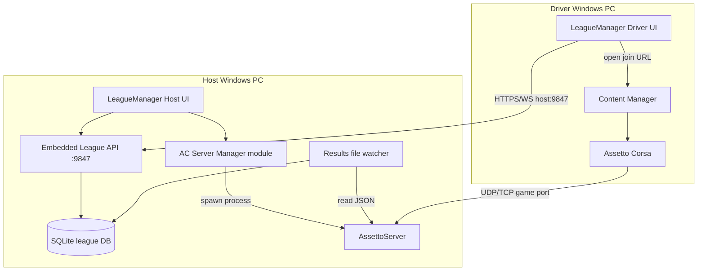
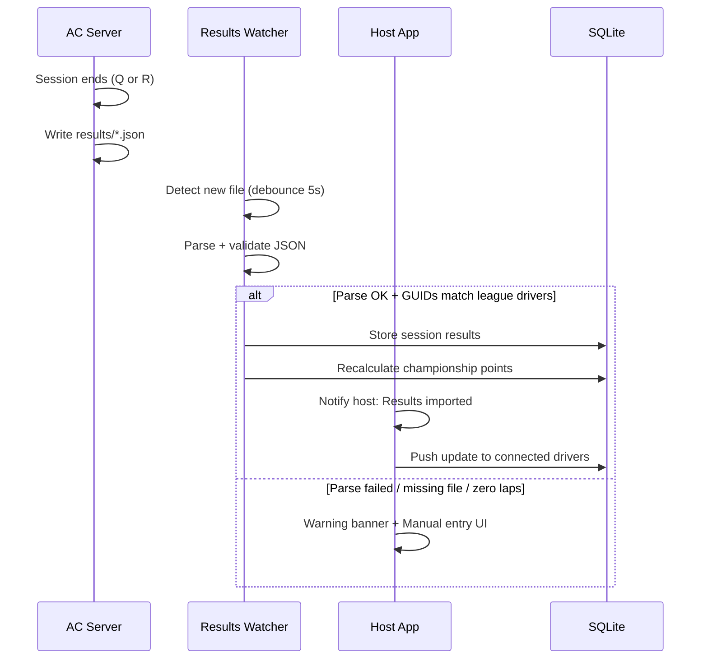
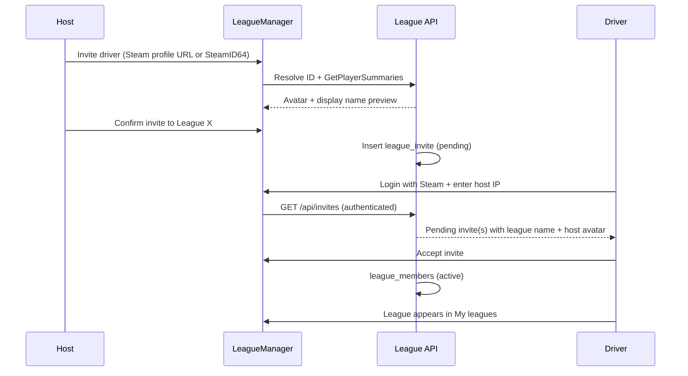

# LeagueManager — Detailed Plan of Action

*Desktop app for AC1 league hosting and driver participation via Content Manager.*

---

## 1. Vision summary

A **Windows desktop application** with two modes from the same binary:

| Mode | Who | Core job |
|------|-----|----------|
| **Host** | League organizer | Configure league → launch AC server from app → share join info → auto-collect results → award points |
| **Driver** | League participant | Steam login → connect to host → view standings → join races via Content Manager |

### Assumptions (v1)

- Host runs **Windows** with **Assetto Corsa** (Steam) installed
- Host has **router port forwarding** configured (or UPnP — optional stretch goal)
- Drivers use **Content Manager** to join races
- **No central cloud** in v1 — the host machine is the league hub for metadata; the AC server handles the race

### Out of scope for v1

- macOS / Linux host
- ACC (Competizione)
- Public league discovery marketplace
- Anti-cheat beyond Steam identity

### Locked product decisions

| # | Decision |
|---|----------|
| 1 | **AssettoServer** is the only supported dedicated server binary (not vanilla Kunos `acServer.exe`) |
| 2 | **Host invite via Steam** — drivers cannot self-join a league; host must invite by Steam identity |
| 3 | **Unlimited leagues per host** — one host account manages many independent leagues in the same app |
| 4 | **Steam Web API** — fetch and display **avatars** and **persona names** for all drivers |

---

## 2. How the pieces connect



### Two ports, two purposes

Drivers need **two** pieces of information from the host (both derived from host public IP):

| Port | Purpose | Forwarded? |
|------|---------|------------|
| **League sync port** (default `9847`) | Standings, schedule, registrations, live event status | Yes — TCP |
| **AC HTTP port** (default `8081`) | Content Manager join + server browser | Yes — TCP |
| **AC game port** (default `9600`) | Actual multiplayer | Yes — TCP + UDP |

The app should detect public IP (e.g. `api.ipify.org`) and display copy-paste join instructions for the host.

---

## 3. Recommended tech stack

| Layer | Choice | Why |
|-------|--------|-----|
| Shell | **Tauri 2** (Rust + web UI) | Small binary, native process spawning, single installer |
| UI | **Svelte 5** | Fast to build host/driver panels with shared components |
| League DB | **SQLite** (local on host) | No server setup; drivers fetch via API |
| League API | **Rust (Axum)** inside Tauri | Embedded in host app; drivers call over LAN/internet |
| AC server | **AssettoServer** (required) | HTTP API, CM invite links, server details, active maintenance |
| Steam auth | OpenID 2.0 + **Web API** (`GetPlayerSummaries`) | Identity via OpenID; avatars/names via API key |
| CM join | `shell.open` → `https://acstuff.ru/s/q:race/online/join?...` | Works reliably on Windows |

**Alternative:** Electron + Node if the team prefers TypeScript-only — acceptable, larger bundle.

---

## 4. Server strategy

### AssettoServer (required)

Ship or auto-detect AssettoServer alongside league configs. The app does not support vanilla Kunos `acServer.exe`.

| Capability | AssettoServer |
|------------|---------------|
| Generate `server_cfg.ini` / `entry_list.ini` | Yes |
| HTTP `/INFO` + `/api/details` session monitoring | Yes |
| Results JSON in `results/` folder | Yes |
| Auto CM invite link in logs | Yes |
| CM Server Details | `EnableServerDetails` in `extra_cfg.yml` |
| Bot / AI traffic slots | AI traffic plugins available |

### Server launch flow (host)

1. Host finishes race wizard → app writes configs to `%APPDATA%/LeagueManager/servers/<event-id>/`
2. App copies/symlinks required `content/` cars & track from host's AC install
3. App spawns `AssettoServer.exe -c cfg/server_cfg.ini -e cfg/entry_list.ini`
4. App tails stdout + polls `GET http://127.0.0.1:{HTTP_PORT}/INFO` every 2s
5. UI shows: running / session type / time left / connected drivers
6. Host clicks **Stop server** → graceful kill → trigger results import

### First-run host setup wizard

1. Locate AC install (Steam default path autodetect)
2. Locate or install **AssettoServer** (download from GitHub releases; not the legacy Kunos Steam DS tool)
3. Test port forwarding: app tries external reachability check on game + HTTP ports
4. Set league sync port + optional UPnP toggle
5. Fetch and display public IP

---

## 5. Results collection & points

### How AC1 writes results

After each session ends, the dedicated server writes a JSON file to:

```
<server-root>/results/YYMMDD_HHMMSS_<P|Q|R>.json
```

- **P** = Practice, **Q** = Qualifying, **R** = Race  
- Files are **not written** if zero laps completed in the session (known Kunos behavior)
- Invalid laps may appear as `"time": -1` (track cuts) — parser must treat as non-counting

Reference: [Simresults AC server docs](https://simresults.net/), [Emperor Servers results wiki](https://wiki.emperorservers.com/assetto-corsa-server-manager/results)

### Auto-import pipeline



### Session detection strategy

Use **both**:

1. **File watcher** on `results/` (primary)
2. **`/INFO` polling** — detect `session` index change and `timeleft` hitting 0 (secondary, helps UI)

Map imported files to the active event by:

- Timestamp window (event start → now)
- Track name match
- Session type sequence (expect Q then R if configured)

### Points engine

Configurable per championship:

| Rule | Default |
|------|---------|
| Race finish positions | F1-style 25-18-15… or custom table |
| Pole / fastest lap bonuses | Optional |
| DNS / DNF | 0 points or last-place points |
| Qualifying → grid | Display only unless points for quali configured |
| Penalties | Host manual adjustment post-import |

### Manual results fallback (required)

When auto-import fails, host sees:

- **Warning toast**: "Could not import results for Round 3 — Qualifying"
- **Reason**: file missing / parse error / unknown drivers / zero-lap session
- **Manual entry screen**:
  - Drag-drop JSON file OR paste from driver's `Documents/Assetto Corsa/out/race_out.json`
  - Spreadsheet-style grid: position, driver, best lap, laps, DNF toggle
  - "Apply to championship" button

---

## 6. Steam login & profiles

### OpenID flow (both host and driver)

1. User clicks **Sign in with Steam**
2. App opens OAuth webview → Steam OpenID
3. Return URL: `http://127.0.0.1:<random-port>/auth/steam/callback`
4. App verifies via `openid.mode=check_authentication` POST to Steam
5. Extract SteamID64 from `openid.claimed_id`
6. Fetch profile via Steam Web API `ISteamUser/GetPlayerSummaries`
7. Cache `personaname`, `avatarfull`, `avatarmedium` in local DB (refresh every 24h or on login)
8. Store session token locally (encrypted with Windows credential store)

### Steam Web API

- Register a free API key at [steamcommunity.com/dev/apikey](https://steamcommunity.com/dev/apikey) (one **app-wide** key shipped with LeagueManager or configured on first run)
- Endpoint: `GET https://api.steampowered.com/ISteamUser/GetPlayerSummaries/v2/?key={KEY}&steamids={id1,id2,...}`
- Batch up to 100 Steam IDs per request when refreshing league rosters
- UI shows circular avatar + display name everywhere (roster, standings, invites, live timing)

### Identity usage

| Use | How |
|-----|-----|
| Driver profile | SteamID64 + `personaname` + `avatarfull` from Web API |
| League access | **Invite-only** — see §6.1 |
| Results matching | Match `guid` field in results JSON to invited/accepted drivers |
| Entry list | Pre-fill `entry_list.ini` DRIVERGUID slots for accepted members |

### 6.1 Host invite flow (Steam)

Drivers **cannot** browse or join a league without a host invite.



**Host invite UI options**

| Method | Flow |
|--------|------|
| Paste Steam profile URL | Parse `/profiles/{id}` or `/id/{customurl}` → resolve to SteamID64 |
| Paste SteamID64 directly | For power users |
| Re-invite past driver | Pick from global driver directory on host (any league) |

**States**: `pending` → `accepted` | `declined` | `revoked` | `expired` (optional 30-day TTL)

**Rules**

- Only the host (or co-admin, future) can invite to a league
- Declined invites stay hidden unless host re-sends
- Banned drivers cannot accept new invites to that league
- Driver must use the **same Steam account** in the app as the invited SteamID64

### Security notes

- Always verify OpenID server-side (in Rust), never trust client-only
- League API requests from drivers include session token bound to SteamID64
- Invite acceptance checks `token.steam_id === invite.steam_id64`
- Host can ban SteamID64 per league

---

## 7. Content Manager join flow (driver)

### Settings page

```
League host address: [ 203.0.113.42        ]
League sync port:    [ 9847                ]  (optional, default 9847)
```

App validates connectivity: `GET http://{host}:{syncPort}/api/health`

### Join race button

When host starts an event, driver app shows **Join race**:

1. Fetch `GET /api/events/current` from league API → returns `httpPort`, `password`, `serverName`, `status`
2. Build CM link:
   ```
   https://acstuff.ru/s/q:race/online/join?ip={hostAddress}&httpPort={httpPort}&password={password}
   ```
3. `tauri::shell::open(&url)` — CM handles the rest
4. Optional: show "Install missing content" hint if host configured mod URLs in server details

### Pre-race checklist (driver UI)

- Connected to league hub
- Server status: **Live** / **Not started** / **Finished**
- Required car/track installed (best-effort check against local CM content folder)

---

## 8. Host panel — feature breakdown

### 8.1 League management (multi-league)

- **League switcher** in host nav — host manages unlimited leagues from one install
- Create / rename / archive league (each league is fully isolated: rosters, championships, settings)
- Seasons & rounds per league
- **Invite drivers via Steam** — paste profile URL or SteamID64; preview avatar + name before sending
- Pending invites list with resend / revoke
- Driver roster per league: avatar, display name, Steam ID, car preference, team, status (active/banned)
- Duplicate championship template across leagues (optional convenience)

### 8.2 Race customization wizard

| Step | Options |
|------|---------|
| Track | Scan host AC `content/tracks`, layout picker |
| Cars | Multi-class support; restrict per class |
| Sessions | Practice (optional), Qualifying, Race — duration or laps |
| Grid | From quali results (auto after import) or fixed entry list |
| Weather / time | Sol/CSP weather string or vanilla |
| Rules | Damage, fuel, tyres out, assists |
| Bots | AI slots in `entry_list.ini` (`AI=1`); fixed names for filling grid |
| Password | Per-event or league-wide |

### 8.3 Server control dashboard

- **Start server** / **Stop server** / **Restart**
- Live: connected drivers, current session, countdown
- Copy join link block for Discord
- Public IP + ports display
- Port-forward health indicator (green/red per port)

### 8.4 Championship standings

- Auto-updated after results import
- Export CSV / screenshot share card
- Edit points (penalty adjustment) with audit log

---

## 9. Driver panel — feature breakdown

- Steam login (avatar + display name shown in header)
- **Pending invites** banner when host has invited this Steam account
- **My leagues** — leagues accepted from one or more hosts (saved host addresses)
- Per league: standings table, schedule, past results (member list shows avatars)
- **Live event** card when host is running a round for a league you belong to
- **Join race** → opens CM
- Notification when results are posted (polling or WebSocket)
- No league visible until invite is **accepted** (connecting to host IP alone is not enough)

---

## 10. Data model (SQLite on host)

```
leagues
  id, name, created_at, archived_at, settings_json

drivers
  id, steam_id64, personaname, avatar_url, profile_updated_at

league_invites
  id, league_id, steam_id64, status (pending|accepted|declined|revoked|expired)
  invited_at, responded_at, invited_by_host_steam_id

league_members
  league_id, driver_id, team, status (active|banned), joined_at

championships
  id, league_id, name, points_schema_json

events  (rounds)
  id, championship_id, round_number, track, config_json, status
  scheduled_at, started_at, completed_at

event_sessions
  id, event_id, type (P|Q|R), duration, sort_order

server_runs
  id, event_id, http_port, game_port, password, pid, started_at, stopped_at

session_results
  id, event_id, session_type, source (auto|manual), raw_json, imported_at

result_entries
  id, session_result_id, driver_id, position, best_lap_ms, laps, dnf, guid

points_ledger
  id, event_id, driver_id, points, reason, created_at

host_settings
  ac_path, server_path, server_type, sync_port, last_public_ip
```

Drivers **do not** get a full SQLite copy — they pull JSON via league API.

---

## 11. League API (embedded in host app)

REST + optional WebSocket for live updates.

| Endpoint | Auth | Description |
|----------|------|-------------|
| `GET /api/health` | None | Ping |
| `POST /api/auth/steam` | — | Exchange verified Steam session for API token |
| `GET /api/invites` | Driver | Pending league invites for logged-in Steam ID |
| `POST /api/invites/:id/accept` | Driver | Accept invite → create league_member |
| `POST /api/invites/:id/decline` | Driver | Decline invite |
| `GET /api/leagues` | Driver | Leagues this Steam ID is a member of |
| `GET /api/leagues/:id` | Driver | League info + member list (avatars) |
| `POST /api/admin/leagues/:id/invites` | Host | Create invite by steam_id64 |
| `DELETE /api/admin/leagues/:id/invites/:id` | Host | Revoke pending invite |
| `GET /api/championships` | Driver | List championships (member leagues only) |
| `GET /api/championships/:id/standings` | Driver | Points table |
| `GET /api/events` | Driver | Schedule |
| `GET /api/events/current` | Driver | Live event + join params |
| `GET /api/events/:id/results` | Driver | Round results |
| `POST /api/admin/*` | Host only | CRUD — only on localhost or host-authenticated |

**Host-only admin** routes bind to `127.0.0.1` for UI ↔ backend; public-facing port exposes read-only driver routes.

---

## 12. Implementation phases

### Phase 0 — Foundation (1–2 weeks)

- [x] Tauri + Svelte project scaffold
- [x] Host vs Driver mode toggle (same binary, first-run picker)
- [x] SQLite schema + migrations (multi-league + `league_invites`)
- [x] Steam OpenID login + `GetPlayerSummaries` profile cache
- [x] GitHub CI (build Windows `.msi` / `.exe`)

**Exit criteria:** App installs, Steam login works, empty host/driver shells.

---

### Phase 1 — Host server launch (2–3 weeks)

- [x] AC / server path detection wizard
- [x] Race wizard → generate `server_cfg.ini` + `entry_list.ini`
- [x] Spawn / kill AssettoServer process
- [x] Poll `/INFO` for live status UI
- [x] Public IP detection + port display
- [ ] Basic port-forward test (external TCP probe)

**Exit criteria:** Host configures a race and friends can join via manually shared CM link.

---

### Phase 2 — League API + driver client (2–3 weeks)

- [x] Embedded Axum server on configurable port
- [x] Driver settings: host IP + connection test
- [x] Driver views: standings (static seed data first)
- [x] `Join race` opens CM link from `/api/events/current`
- [x] Host shares one address; driver sees live event status

**Exit criteria:** Driver app connects to host IP and joins running server through CM.

---

### Phase 3 — Results & points (2–3 weeks)

- [x] Results folder watcher + JSON parser (AC1 format)
- [x] Map GUIDs → league drivers
- [x] Qualifying + race import for multi-session events
- [x] Points calculation engine
- [x] Failure warnings + manual results UI
- [x] Standings auto-refresh on driver clients

**Exit criteria:** Full event loop: host runs race → results appear → standings update without manual spreadsheet.

---

### Phase 4 — League management polish (2 weeks)

- [x] Steam invite flow (host send → driver accept/decline)
- [x] Multi-league switcher for host
- [x] Steam `GetPlayerSummaries` batch refresh for rosters
- [x] Multi-round championships
- [x] Bot / AI entry list slots
- [x] Mod download URLs in server details (CM missing content)
- [x] Export results / standings

**Exit criteria:** Host can run a multi-round league with a small grid including bots.

---

### Phase 5 — Hardening (ongoing)

- [ ] UPnP optional port mapping
- [ ] Auto-update (Tauri updater)
- [ ] Crash recovery if AC server dies mid-session
- [ ] Backup / restore league DB
- [ ] Logging & support bundle export

---

## 13. UI wireframe outline

### Host — main navigation

```
[League] [Championship] [Events] [Drivers] [Server] [Settings]
```

### Host — Server tab (during event)

```
┌─────────────────────────────────────────────────────────┐
│  Round 3 — Spa · Qualifying + Race          ● RUNNING  │
├─────────────────────────────────────────────────────────┤
│  Session: Race          Time left: 12:34                │
│  Connected: 8 / 16                                      │
│                                                         │
│  Public IP: 203.0.113.42                                │
│  Game port: 9600 (UDP+TCP) ✓   HTTP: 8081 ✓            │
│  League port: 9847 ✓                                    │
│                                                         │
│  [Copy CM join link]  [Copy driver app address]         │
│                                                         │
│  [Stop server]                                          │
└─────────────────────────────────────────────────────────┘
```

### Driver — home

```
┌─────────────────────────────────────────────────────────┐
│  Bob's League @ 203.0.113.42                            │
├─────────────────────────────────────────────────────────┤
│  🔴 LIVE NOW — Round 3, Spa                             │
│  [ Join race in Content Manager ]                       │
├─────────────────────────────────────────────────────────┤
│  Championship standings                                 │
│  1. Alice      87 pts                                   │
│  2. You        72 pts                                   │
│  ...                                                    │
└─────────────────────────────────────────────────────────┘
```

---

## 14. Risks & mitigations

| Risk | Impact | Mitigation |
|------|--------|------------|
| Results JSON not written (zero laps, crash, admin skip) | Missing standings | Manual entry UI; warn host; document "wait for session timer" |
| Port forwarding misconfigured | Drivers can't join | Setup wizard with per-port test; clear instructions |
| Host offline = no standings API | Drivers can't sync | Cache last standings locally in driver app |
| Steam OpenID in desktop webview | Auth fragility | Use localhost callback; well-tested library |
| Invalid lap times (`-1`) | Wrong quali order | Parser treats as invalid; optional Simresults-compatible logic |
| Mod mismatches | Drivers can't join | Server details + mod URL list; pre-race checklist |
| AGPL if using AssettoServer plugins | License | Don't ship modified server; use stock binary + external app |

---

## 15. Remaining minor decisions

| Topic | Default unless you say otherwise |
|-------|----------------------------------|
| Offline standings cache (driver) | 7 days local cache per league |
| Invite expiry | 30 days, host can re-send |
| Steam API key | Single app-wide key in build config (not user-supplied) |

---

## 16. Immediate next steps

1. Phase 0 scaffold: Tauri + Svelte + SQLite + Steam OpenID + `GetPlayerSummaries`
2. Phase 1 spike: launch AssettoServer from app and join via CM link
3. Capture a real `results/*.json` from AssettoServer to build the parser against
4. Implement invite flow early (Phase 2) — it gates all driver league access

---

## 17. Reference links

- CM join URL: `https://acstuff.ru/s/q:race/online/join`
- AssettoServer docs: https://assettoserver.org/docs/
- AC1 results format: https://simresults.net/
- Steam OpenID: https://partner.steamgames.com/doc/features/auth
- Server Manager championships (feature reference): https://github.com/JustaPenguin/assetto-server-manager/wiki/About-Championships
